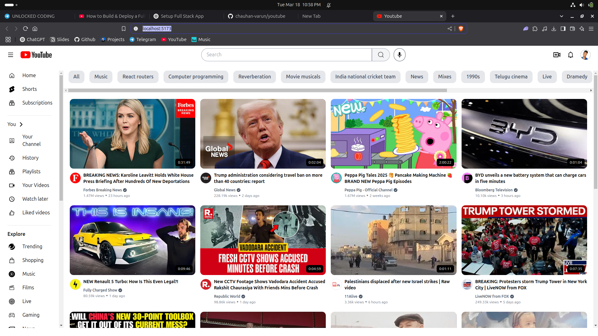

## Get the Api from https://rapidapi.com/hub

# Its just frontend that i made, for the backend i used the api
# Live Link of project 😂 : https://adfreeyoutube.onrender.com

`Note:`
live link might not work at the time you open cuz of api limit
add api in .env 

npm install
npm run dev
